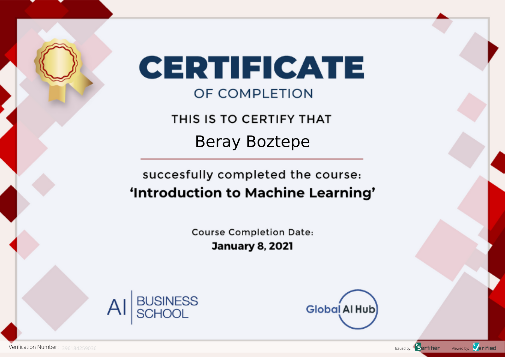

# GAIH Student Repo Example

**Course Date:** 04.01.2021

**Name:** Emre Beray  
**Surname:** Boztepe  
**Email:** berayboztepe@outlook.com  

## Project Name
- Here are my homework, final project, and certificate for the course that've been given by Global AI Hub.

- In this project, the wine_quality dataset has been imported, and the main goal of the project is to build classification models to decide which one is better.

- Also, EDA has been performed to improve the performance of the model. Possible overfitting and underfitting problems have been tried to prevent.

---

### Certification

